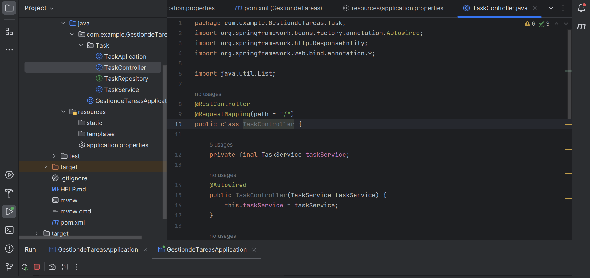
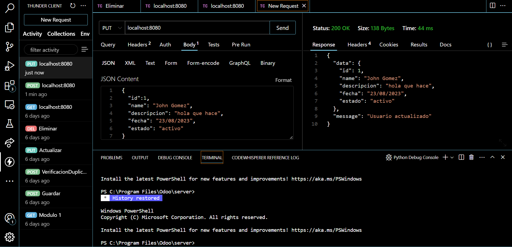

# API-REST-para-Gestion-de-Tareas
# Guía de Configuración y Uso de Proyecto Spring Boot

Esta guía detalla los pasos necesarios para configurar y utilizar un proyecto Spring Boot que implementa una aplicación web con acceso a una base de datos en memoria (H2).

## Paso 1: Configuración Inicial

1. Crea un nuevo proyecto Spring Boot utilizando Spring Initializr. Asegúrate de incluir las dependencias necesarias para crear una aplicación web y acceder a una base de datos en memoria (por ejemplo, H2).
2. Configura la conexión a la base de datos en el archivo `application.properties`.

## Paso 2: Modelo de Datos

1. Crea una entidad llamada `Task` con los siguientes atributos: id, nombre, descripción, fecha, estado, etc. Utiliza anotaciones de JPA para mapear la entidad a la base de datos.

## Paso 3: Repositorio

1. Crea un repositorio llamado `TaskRepository` que extienda `JpaRepository`. Este repositorio te permitirá acceder a la base de datos y realizar operaciones CRUD sobre las tareas.

## Paso 4: Controlador

1. Crea un controlador llamado `TaskController` con rutas para cada operación CRUD (por ejemplo, `/api/tasks`). Utiliza las siguientes anotaciones: `@RestController`, `@GetMapping`, `@PostMapping`, `@PutMapping`, `@DeleteMapping`.

## Paso 5: Servicio

1. Crea un servicio llamado `TaskService` que utilice el `TaskRepository` para implementar los métodos de CRUD (por ejemplo, `createTask`, `getTask`, `updateTask`, `deleteTask`, etc.).

## Paso 6: Pruebas

1. Utiliza herramientas como Postman para realizar pruebas sobre la API que has creado.
2. Envía solicitudes POST, GET, PUT y DELETE para crear, leer, actualizar y eliminar tareas.

¡Ahora estás listo para desarrollar y probar tu aplicación Spring Boot con acceso a una base de datos en memoria!

## Nota

Este proyecto utiliza una base de datos en memoria (H2) para simplificar el proceso de desarrollo y pruebas. Si deseas utilizar una base de datos diferente en un entorno de producción, asegúrate de actualizar la configuración en consecuencia.
